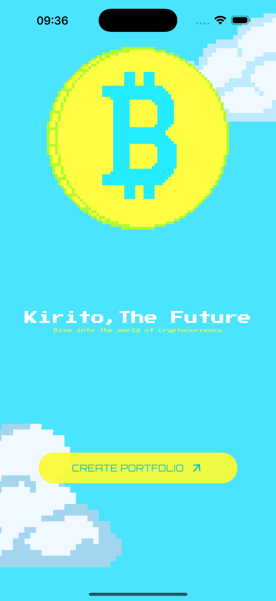
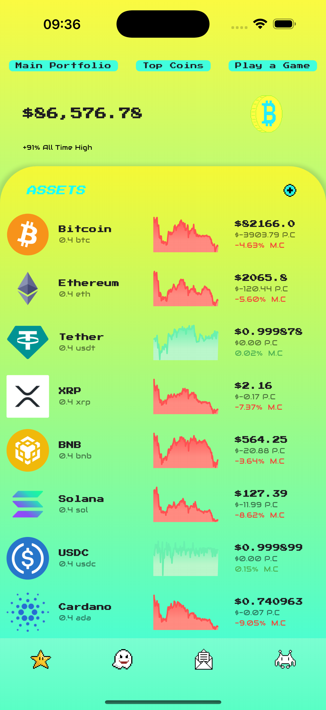
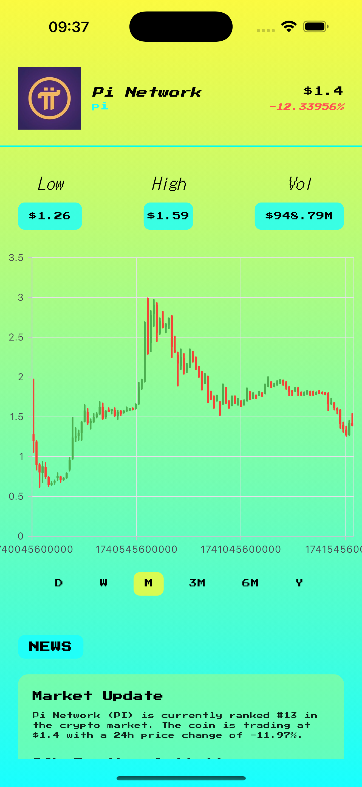
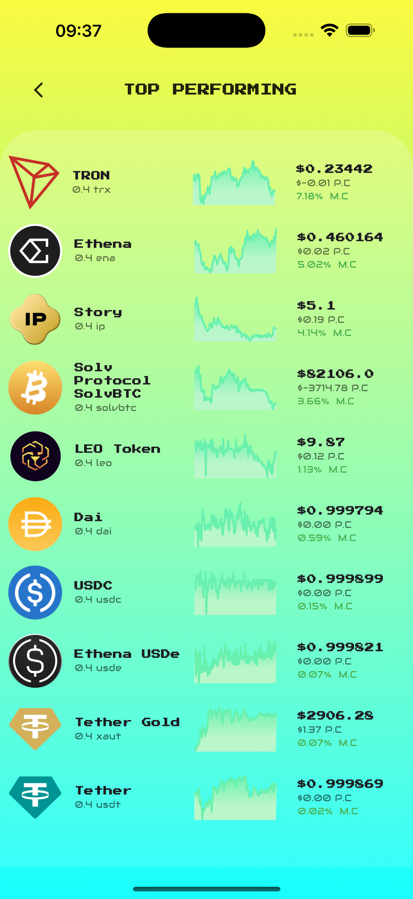
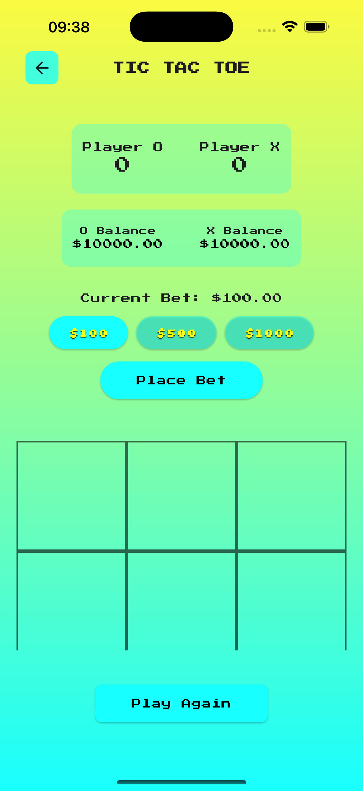
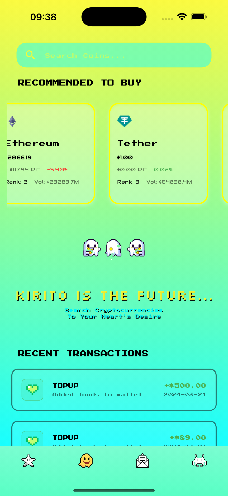
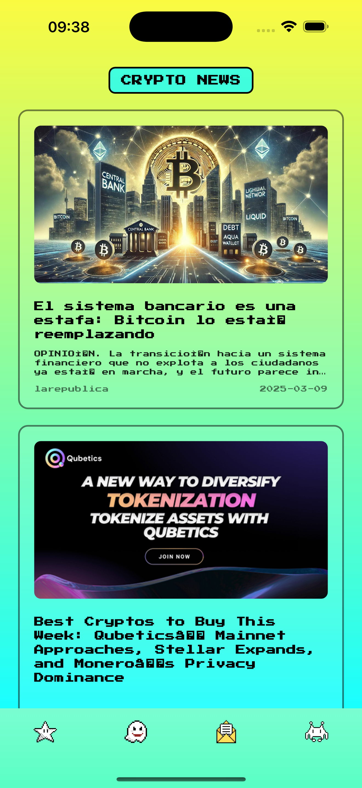
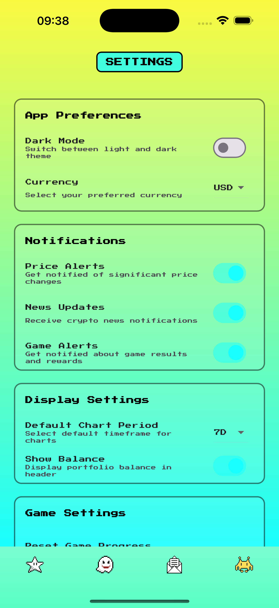
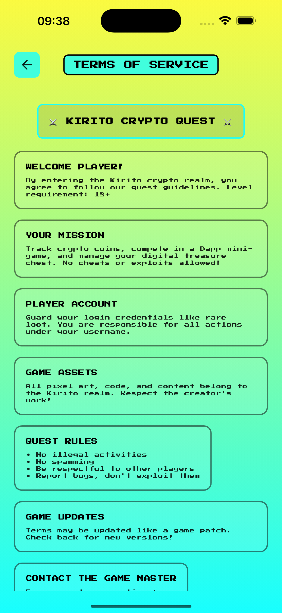
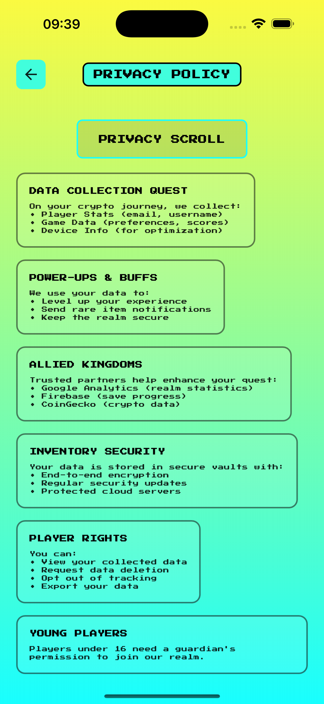

# Kirito Crypto Wallet Quest 🎮

<div align="center">


[](https://flutter.dev/)
[](https://www.python.org/)
[](https://pub.dev/packages/flutter_riverpod)
[](https://www.coingecko.com/en/api)

</div>

A pixel-themed cryptocurrency tracking app built with Flutter that combines crypto monitoring, news updates, and gaming elements in a unique retro-styled interface.

## ✨ Features

### 💰 Cryptocurrency Tracking

- Real-time cryptocurrency price updates
- Detailed coin information and statistics
- Interactive price charts with multiple timeframes
- Market cap and volume tracking
- Portfolio value tracking
- Top performing coins section

### 📰 Crypto News

- Latest cryptocurrency news updates
- News filtering and categorization
- Direct links to news sources
- Real-time news refresh

### 🎮 Gaming Elements

- Integrated Tic-Tac-Toe mini-game
- Virtual betting system
- Player balances and scores
- Win/loss tracking

### 🎨 Unique UI/UX

- Pixel art design theme
- Retro-styled animations
- Interactive charts and graphs
- Responsive layout
- Custom navigation

## 🛠 Technical Stack

### Frontend

- Flutter for cross-platform development
- Custom animations and transitions
- Responsive design implementation
- Chart visualization using SyncFusion
- Google Fonts integration

### Backend Services

- CoinGecko API for cryptocurrency data
- NewsData.io for crypto news
- Environment variable management
- HTTP request handling

## 🚀 Getting Started

### Prerequisites

- Flutter (latest version)
- Dart SDK
- API keys for NewsData.io
- Android Studio / VS Code
- Git

### Installation

1. Clone the repository

```bash
git clone https://github.com/joewrdd/kirito_crypto_wallet.git
```

2. Install dependencies

```bash
cd kirito_crypto_wallet
flutter pub get
```

3. Configure API Keys

- Create a .env file in the root directory
- Add your NewsData.io API key:

```
NEWS_API_KEY=your_api_key_here
```

4. Run the app

```bash
flutter run
```

## 📁 Project Structure

```
lib/
├── models/             # Data models
├── services/           # API services
├── views/             # UI screens
│   ├── widgets/      # Reusable widgets
│   └── screens/      # Main screens
└── main.dart         # Entry point
```

## 🎯 Features in Detail

### Cryptocurrency Features

- Real-time price tracking
- Historical price charts
- Market statistics
- Portfolio management
- Top performers tracking

### News Features

- Latest crypto news
- News categorization
- Source filtering
- Share functionality

### Game Features

- Tic-Tac-Toe gameplay
- Virtual betting system
- Score tracking
- Player statistics

## 🔒 Privacy & Security

- Secure API handling
- Local data storage
- No personal data collection
- Transparent data usage

## 📸 Screenshots

<div align="center">
  <div style="display: flex; flex-direction: column; align-items: center;">
    <!-- Main Screen -->
    <div style="flex: 2; padding: 10px;">
      <p><strong>Main Screens</strong></p>
      <div style="display: flex; gap: 10px;">
        
        
      </div>
    </div>
    <!-- Top Performers & Crypto Details-->
    <div style="flex: 2; padding: 10px; margin-top: 20px;">
      <p><strong>Top Performers & Crypto Details</strong></p>
      <div style="display: flex; gap: 10px;">
        
        
      </div>
    </div>
    <!-- Search & Game -->
    <div style="flex: 2; padding: 10px; margin-top: 20px;">
      <p><strong>Search Feature, With Transaction History + Betting Game</strong></p>
      <div style="display: flex; gap: 10px;">
        
        
      </div>
    </div>
    <!-- Settings & News -->
    <div style="flex: 2; padding: 10px; margin-top: 20px;">
      <p><strong>Settings & News</strong></p>
      <div style="display: flex; gap: 10px;">
        
        
      </div>
    </div>
    <!-- Privacy Policy & TOS -->
    <div style="flex: 2; padding: 10px; margin-top: 20px;">
      <p><strong>Privacy Policy & Term Of Service</strong></p>
      <div style="display: flex; gap: 10px;">
        
        
      </div>
    </div>
  </div>
</div>

## 🤝 Contributing

Contributions are welcome! Please feel free to submit a Pull Request.

## 📝 License

This project is licensed under the MIT License - see the LICENSE file for details.

## 👨‍💻 Author

Joe Ward - [GitHub Profile](https://github.com/joewrdd)

## 🙏 Acknowledgments

- CoinGecko API for cryptocurrency data
- NewsData.io for news updates
- Flutter for the UI integration
